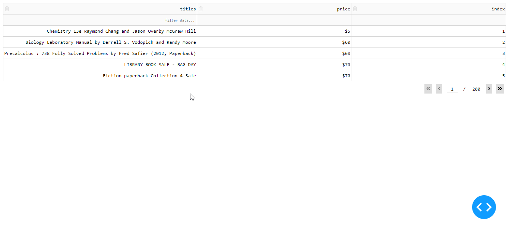

Hank Yun 

# Exploring [Craigslist's book and magazine](http://newyork.craigslist.org/search/bka)

1. Scraping 1000 items’ titles and prices
1. MYSQL Database
1. Simple item search web application using Dash and Heroku

** Difficulty Deploying web application in Heroku. Runs locally.

